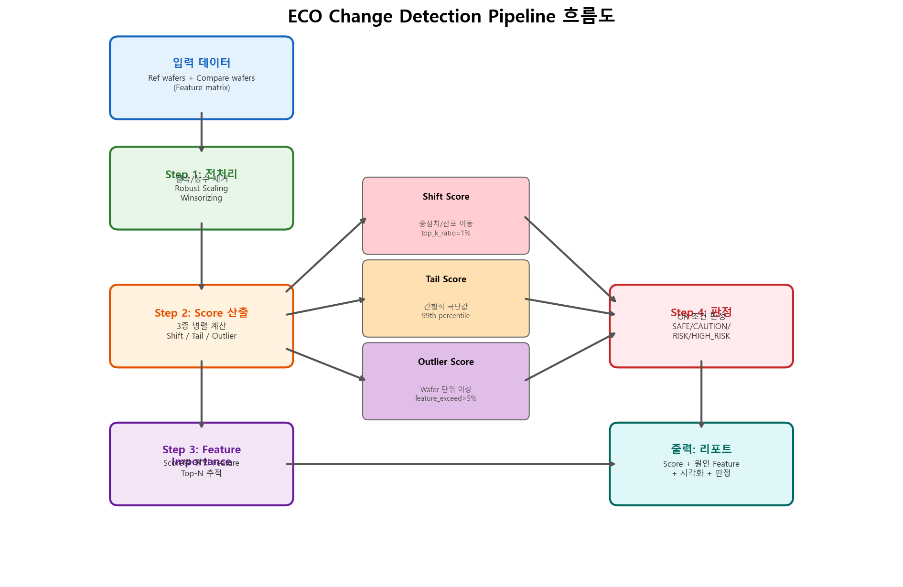

# ECO Change Detection PoC

반도체 공정 변경점(ECO) 적용 전후의 품질 차이를 자동으로 정량화하고, 차이의 주요 원인 Feature를 식별하는 분석 파이프라인입니다.

**[프로젝트 페이지 (GitHub Pages)](https://mangotengcherry.github.io/change_point_detection/)**

---

## 핵심 질문

| # | 질문 | 해결 방법 |
|---|------|-----------|
| 1 | Ref와 Compare 사이에 **얼마나 다른가?** | 3종 Score로 정량화 (Shift / Tail / Outlier) |
| 2 | **어떤 Feature**가 Score 변동에 가장 크게 기여하는가? | Score별 Feature Importance 추적 |

## 파이프라인 구조

```
[입력] ref wafers + compare wafers (feature matrix)
  │
  ▼ Step 1: 전처리
  │  - 결측/상수 변수 제거
  │  - Ref 기준 Robust Scaling (median / IQR)
  │  - Winsorizing (0.5th ~ 99.5th)
  │
  ▼ Step 2: Score 산출 (3종 병렬)
  │  - Shift Score: 중심치/산포 이동 (Top-K z-shift 평균)
  │  - Tail Score: 간헐적 극단값 (99th percentile 초과 비율)
  │  - Outlier Wafer Score: 다변량 wafer 이상 (feature 동시 초과)
  │
  ▼ Step 3: Feature Importance 추적
  │  - Shift / Tail / Outlier 원인 Feature Top-N
  │
  ▼ Step 4: 판정 + 리포트
  │  - SAFE / CAUTION / RISK / HIGH_RISK
  │  - 시각화 + 원인 요약
  │
  ▼ [출력] 변경점 검증 리포트
```

## PoC 실험 결과 요약

합성 데이터(Ref 1,000장, Compare 80장, Feature 5,000개)에 3가지 불량 패턴을 삽입하여 파이프라인을 검증했습니다.

### Score 결과

| Score | 값 | 판정 |
|-------|-----|------|
| Shift Score | **0.807** | CAUTION |
| Tail Score (max) | **31.25%** | HIGH_RISK |
| Tail Feature Count | **641개** | - |
| Outlier Wafer Rate | **6.25%** (5/80) | RISK |
| **최종 판정** | | **HIGH_RISK** |

### 삽입 패턴 검출 결과

| 패턴 | 대상 | 검출 Score | 검증 |
|-------|------|------------|------|
| Pattern A: Systematic Shift | EDS_0100~0120 | Shift Score Top-10에 포함 | PASS |
| Pattern B: Intermittent Spike | EDS_0500~0510 | Tail Score에서 검출 | PASS |
| Pattern C: Multi-Feature Outlier | Wafer 70~74 | Outlier Wafer에 정확히 포함 | PASS |

### 민감도 검증

- **False Alarm Test**: Ref를 반으로 나누어 비교 시 모든 Score ≈ 0 확인
- **단조 증가 검증**: Shift 크기를 점진적으로 늘렸을 때 Score 단조 증가 확인
- **Sample Size 검증**: Compare 30장 미만 시 Score 변동성 급증 확인

## 시각화 결과

### 합성 데이터 구조


### 전처리 과정


### Score 산출 과정


### Feature Importance


### 최종 리포트 대시보드


### 민감도 분석


### 추가 인사이트 (Violin, Scatter, Correlation, CDF)


### 파이프라인 흐름도


## 프로젝트 구조

```
change_point_detection/
├── README.md
├── requirements.txt
├── src/
│   ├── eco_change_detection.py    # 핵심 파이프라인 코드
│   └── run_experiment.py          # 실험 실행 + 시각화 생성
├── results/                       # 생성된 시각화 이미지
│   ├── 01_synthetic_data_structure.png
│   ├── 02_preprocessing_steps.png
│   ├── 03_score_calculation.png
│   ├── 04_feature_importance.png
│   ├── 05_final_report.png
│   ├── 06_sensitivity_analysis.png
│   ├── 07_additional_insights.png
│   └── 08_pipeline_flow.png
└── docs/                          # GitHub Pages
    ├── index.html
    └── images/                    # 페이지용 이미지 복사본
```

## 실행 방법

```bash
# 의존성 설치
pip install -r requirements.txt

# 실험 실행 (합성 데이터 생성 + 파이프라인 + 시각화)
python src/run_experiment.py
```

## 의존성

```
pandas >= 1.5
numpy >= 1.23
matplotlib >= 3.6
seaborn >= 0.12
scipy >= 1.9
scikit-learn >= 1.2
```

## 향후 확장

| 순서 | 확장 내용 | 목적 |
|------|-----------|------|
| 1 | PCA 보조 Score 안정화 | Feature 상관성에 의한 noise 감소 |
| 2 | Matched Comparison | 설비/시간 등 confounding 통제 |
| 3 | 변경점 유형별 Rule | 판정 정밀화 |
| 4 | Stage 0~4 체계 연계 | 현업 프로세스 통합 |
| 5 | 사례 DB + Supervised Classifier | 자동화 고도화 |

## 참고 문헌

1. Montgomery, D.C. (2019). *Introduction to Statistical Quality Control*, 8th Ed. Wiley.
2. Hawkins, D.M. & Olwell, D.H. (1998). *Cumulative Sum Charts and Charting for Quality Improvement*. Springer.
3. Rousseeuw, P.J. & Croux, C. (1993). "Alternatives to the Median Absolute Deviation." *JASA*, 88(424).
4. Hubert, M. & Vandervieren, E. (2008). "An Adjusted Boxplot for Skewed Distributions." *CSDA*, 52(12).
5. Hodge, V.J. & Austin, J. (2004). "A Survey of Outlier Detection Methodologies." *AI Review*, 22(2).
6. Apley, D.W. & Shi, J. (2001). "A Factor-Analysis Method for Diagnosing Variability in Multivariate Manufacturing Processes." *Technometrics*, 43(1).
7. Chen, S. & Nembhard, H.B. (2011). "High-Dimensional Process Monitoring and Diagnosis via Sparse Principal Components." *IIE Transactions*, 43(10).
8. Qiu, P. (2013). *Introduction to Statistical Process Control*. Chapman & Hall/CRC.
