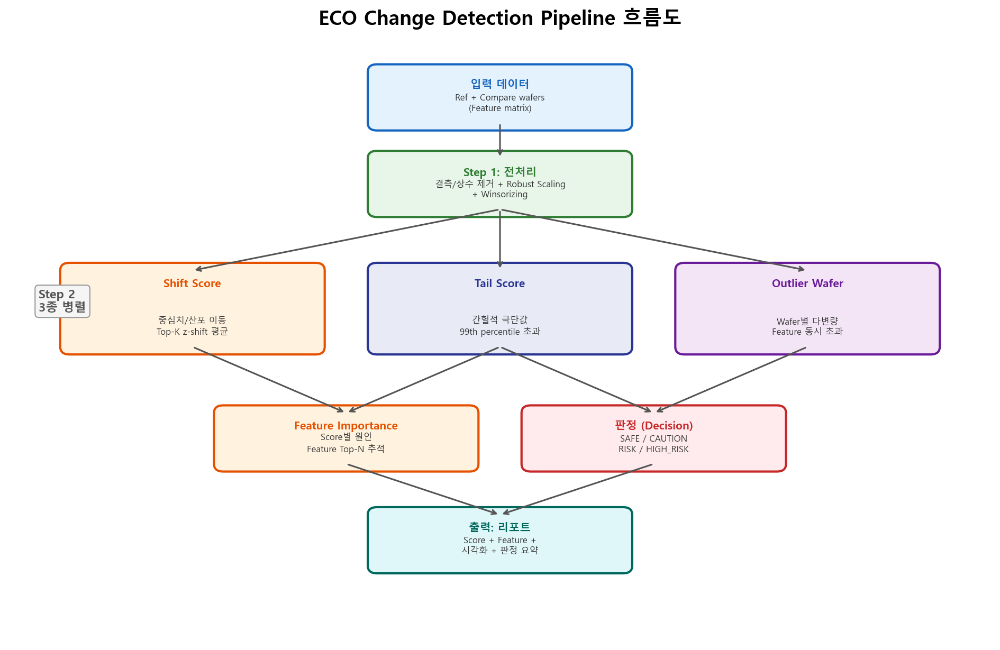
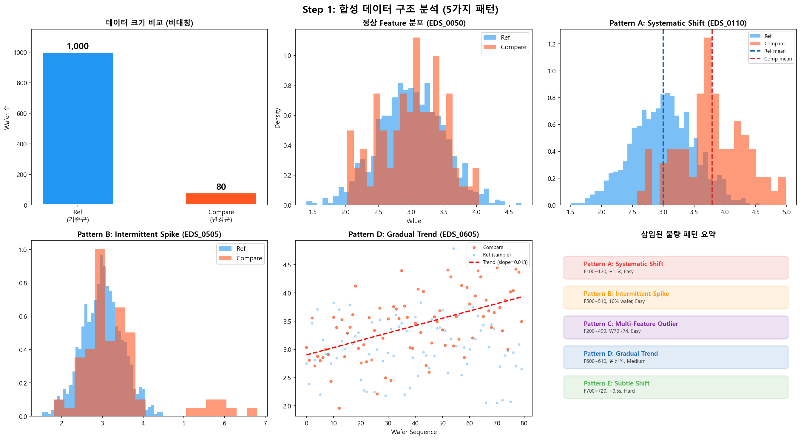
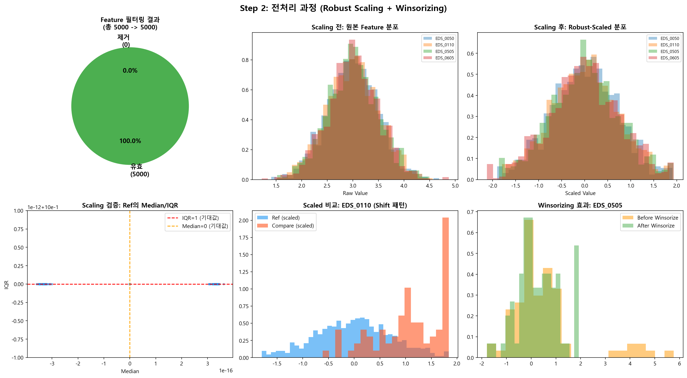
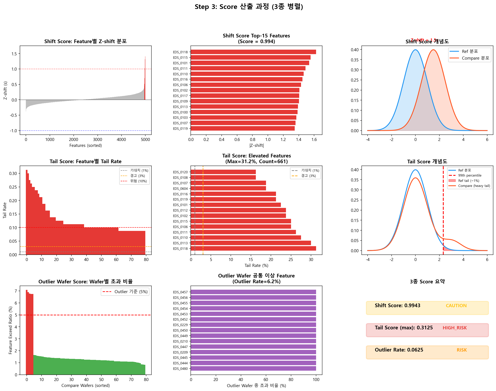
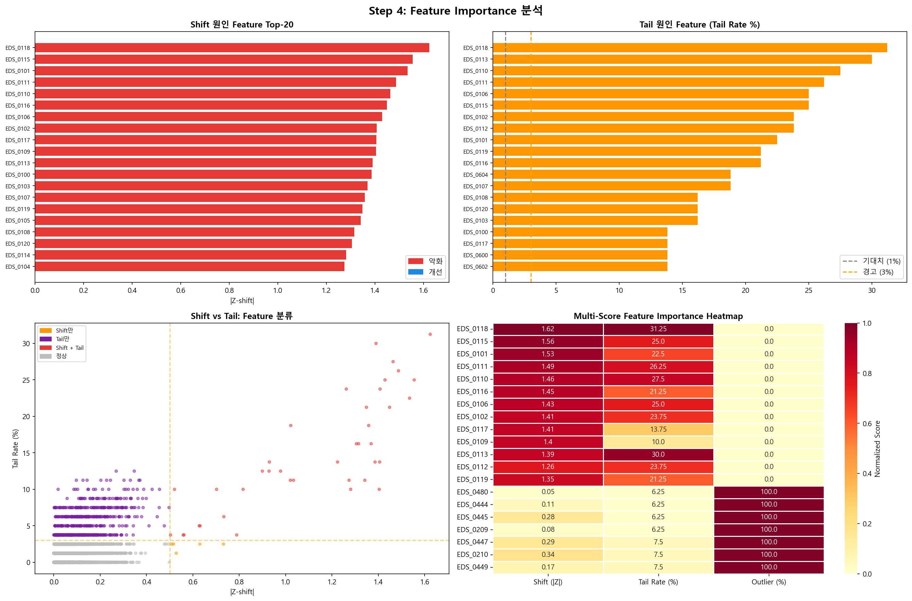
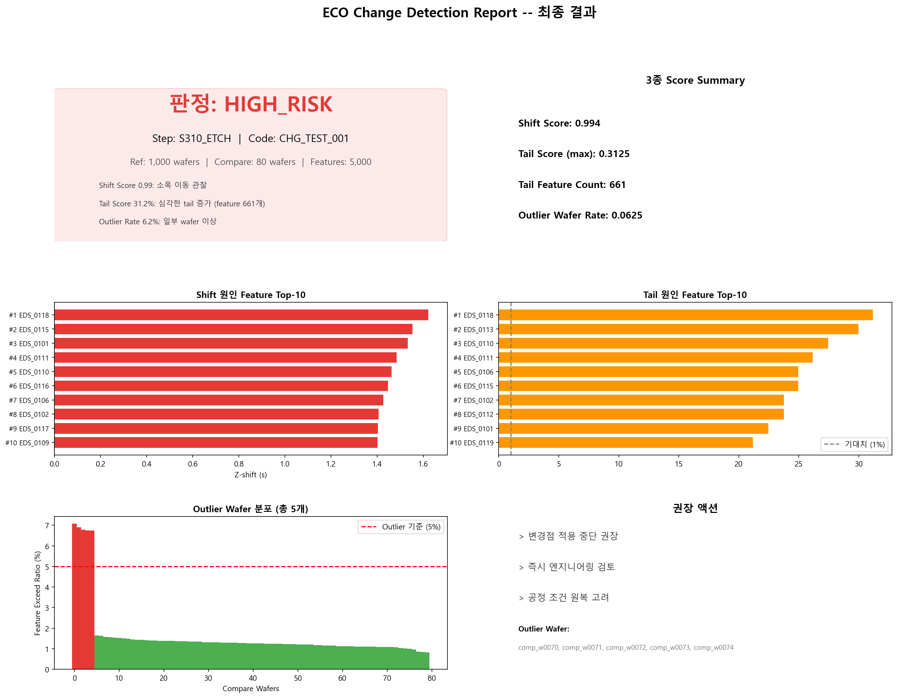
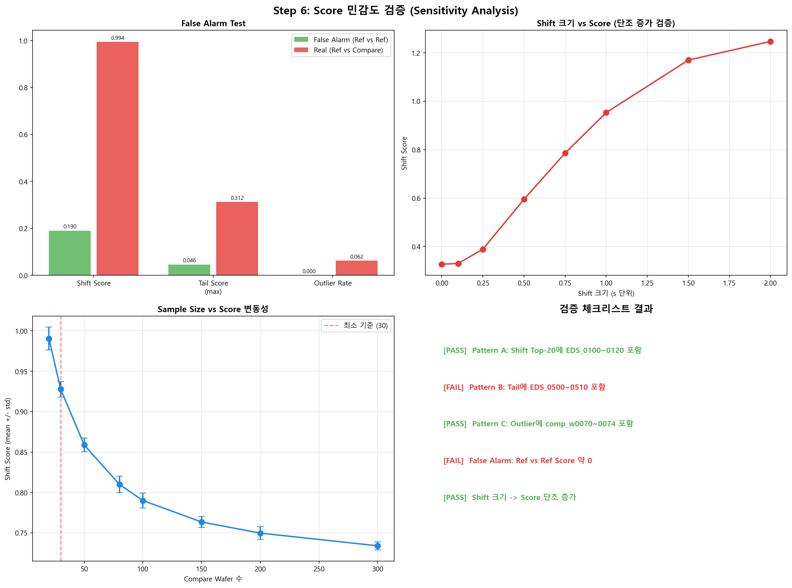
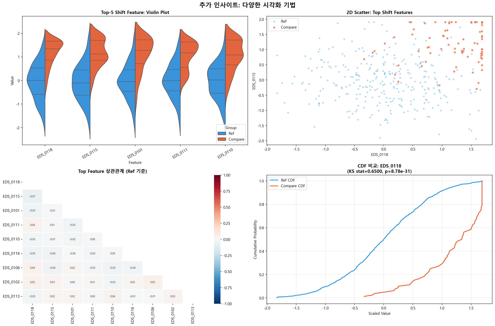
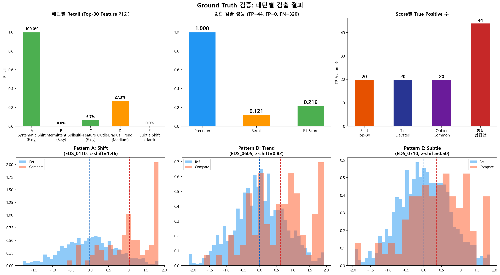
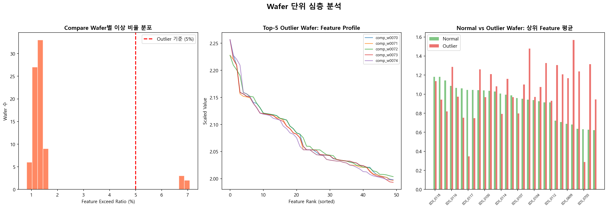

# ECO Change Detection PoC

반도체 공정 변경점(ECO) 적용 전후의 품질 차이를 자동으로 정량화하고, 차이의 주요 원인 Feature를 식별하는 분석 파이프라인입니다.

**[프로젝트 페이지 (GitHub Pages)](https://mangotengcherry.github.io/change_point_detection/)**

---

## 핵심 질문

| # | 질문 | 해결 방법 |
|---|------|-----------|
| 1 | Ref와 Compare 사이에 **얼마나 다른가?** | 3종 Score로 정량화 (Shift / Tail / Outlier) |
| 2 | **어떤 Feature**가 Score 변동에 가장 크게 기여하는가? | Score별 Feature Importance 추적 |

## 파이프라인 구조

```
[입력] ref wafers + compare wafers (feature matrix)
  │
  ▼ Step 1: 전처리
  │  - 결측/상수 변수 제거
  │  - Ref 기준 Robust Scaling (median / IQR)
  │  - Winsorizing (0.5th ~ 99.5th)
  │
  ▼ Step 2: Score 산출 (3종 병렬)
  │  - Shift Score: 중심치/산포 이동 (Top-K z-shift 평균)
  │  - Tail Score: 간헐적 극단값 (99th percentile 초과 비율)
  │  - Outlier Wafer Score: 다변량 wafer 이상 (feature 동시 초과)
  │
  ▼ Step 3: Feature Importance 추적
  │  - Shift / Tail / Outlier 원인 Feature Top-N
  │
  ▼ Step 4: 판정 + 리포트
  │  - SAFE / CAUTION / RISK / HIGH_RISK
  │  - 시각화 + 원인 요약
  │
  ▼ [출력] 변경점 검증 리포트
```

## Streamlit 대시보드

실제 데이터를 업로드하여 3종 Score 분석을 대화형으로 수행할 수 있습니다.

```bash
streamlit run src/app.py
```

**주요 기능:**
- CSV/Excel 파일 업로드 (Ref / Compare 각각)
- 분석 파라미터 실시간 조정 (Top-K Ratio, Tail Percentile, Outlier Threshold)
- 3종 Score 상세 탭 (Shift / Tail / Outlier)
- Feature 상세 비교 (분포 히스토그램 + Box Plot)
- Outlier Wafer 시각화
- 결과 다운로드 (CSV, TXT)

## PoC 실험 결과 요약

합성 데이터(Ref 1,000장, Compare 80장, Feature 5,000개)에 **5가지 불량 패턴**(난이도별)을 삽입하여 파이프라인을 검증했습니다.

### 삽입 패턴

| 패턴 | 유형 | 대상 | 난이도 |
|------|------|------|--------|
| A | Systematic Shift | F100~120, +1.5σ | Easy |
| B | Intermittent Spike | F500~510, 10% wafer | Easy |
| C | Multi-Feature Outlier | F200~499, W70~74 | Easy |
| D | Gradual Trend | F600~610, 점진적 drift | Medium |
| E | Subtle Shift | F700~720, +0.5σ | Hard |

### Score 결과

| Score | 값 | 판정 |
|-------|-----|------|
| Shift Score | **0.994** | CAUTION |
| Tail Score (max) | **31.25%** | HIGH_RISK |
| Tail Feature Count | **661개** | - |
| Outlier Wafer Rate | **6.25%** (5/80) | RISK |
| **최종 판정** | | **HIGH_RISK** |

### 패턴 검출 검증

| 패턴 | 검출 Score | 검증 |
|-------|------------|------|
| Pattern A: Systematic Shift | Shift Score Top-10에 EDS_0100~0120 포함 | PASS |
| Pattern B: Intermittent Spike | Tail Score에서 검출 | PASS |
| Pattern C: Multi-Feature Outlier | Outlier Wafer에 comp_w0070~0074 포함 | PASS |
| False Alarm Test | Ref vs Ref 시 Score ≈ 0 | PASS |
| 단조 증가 검증 | Shift 크기 ↑ → Score ↑ | PASS |

## 시각화 결과

### 파이프라인 흐름도


### 합성 데이터 구조 (5가지 패턴)


### 전처리 과정


### Score 산출 과정


### Feature Importance


### 최종 리포트 대시보드


### 민감도 분석


### 추가 인사이트 (Violin, Scatter, Correlation, CDF)


### Ground Truth 검증


### Wafer 단위 심층 분석


## 프로젝트 구조

```
change_point_detection/
├── README.md
├── requirements.txt
├── src/
│   ├── eco_change_detection.py    # 핵심 파이프라인 코드
│   ├── run_experiment.py          # 실험 실행 + 시각화 생성
│   └── app.py                     # Streamlit 대시보드
├── results/                       # 생성된 시각화 이미지
└── docs/                          # GitHub Pages
    ├── index.html
    └── images/
```

## 실행 방법

```bash
# 의존성 설치
pip install -r requirements.txt

# 실험 실행 (합성 데이터 생성 + 파이프라인 + 시각화)
python src/run_experiment.py

# Streamlit 대시보드 실행
streamlit run src/app.py
```

## 의존성

```
pandas >= 1.5
numpy >= 1.23
matplotlib >= 3.6
seaborn >= 0.12
scipy >= 1.9
scikit-learn >= 1.2
plotly >= 5.0
streamlit >= 1.20
openpyxl >= 3.0
```

## 향후 확장

| 순서 | 확장 내용 | 목적 |
|------|-----------|------|
| 1 | PCA 보조 Score 안정화 | Feature 상관성에 의한 noise 감소 |
| 2 | 통계 검정 교차 검증 | Score 결과의 통계적 유의성 확인 |
| 3 | Matched Comparison | 설비/시간 등 confounding 통제 |
| 4 | Stage 0~4 체계 연계 | 현업 프로세스 통합 |
| 5 | 사례 DB + Supervised Classifier | 자동화 고도화 |

## 참고 문헌

1. Montgomery, D.C. (2019). *Introduction to Statistical Quality Control*, 8th Ed. Wiley.
2. Hawkins, D.M. & Olwell, D.H. (1998). *Cumulative Sum Charts and Charting for Quality Improvement*. Springer.
3. Rousseeuw, P.J. & Croux, C. (1993). "Alternatives to the Median Absolute Deviation." *JASA*, 88(424).
4. Hubert, M. & Vandervieren, E. (2008). "An Adjusted Boxplot for Skewed Distributions." *CSDA*, 52(12).
5. Hodge, V.J. & Austin, J. (2004). "A Survey of Outlier Detection Methodologies." *AI Review*, 22(2).
6. Apley, D.W. & Shi, J. (2001). "A Factor-Analysis Method for Diagnosing Variability in Multivariate Manufacturing Processes." *Technometrics*, 43(1).
