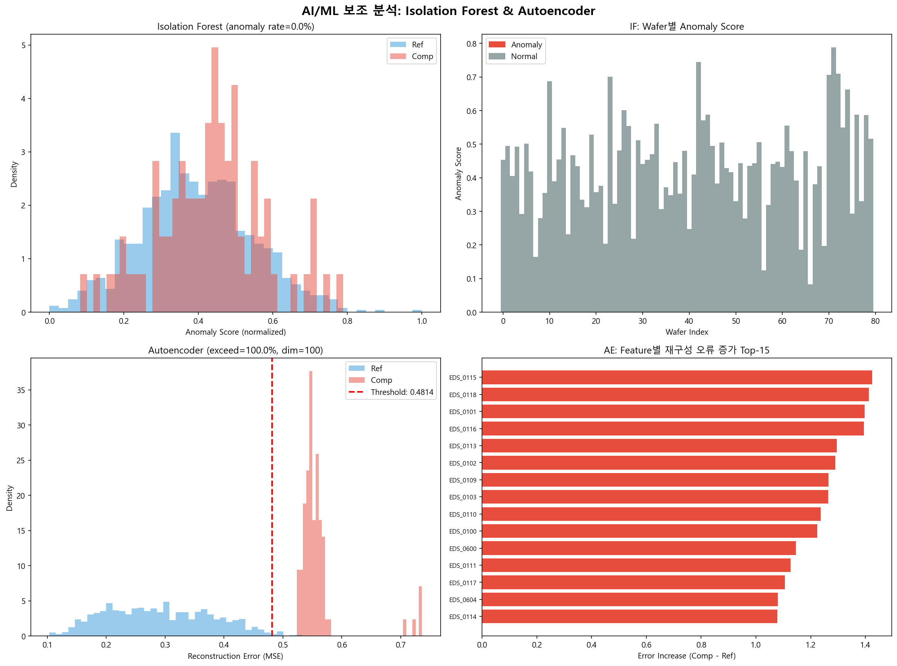
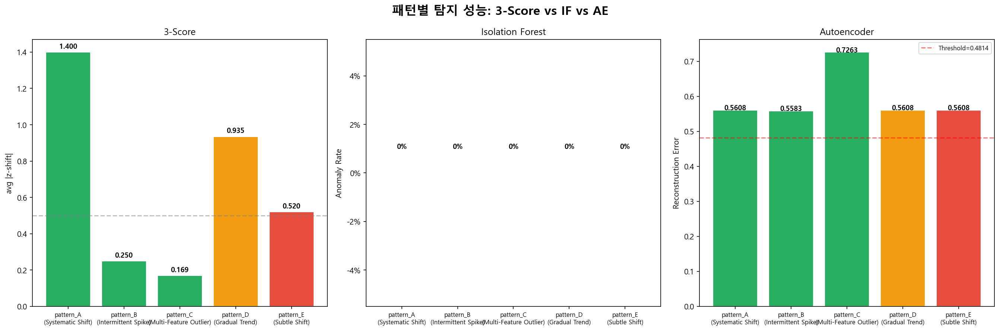
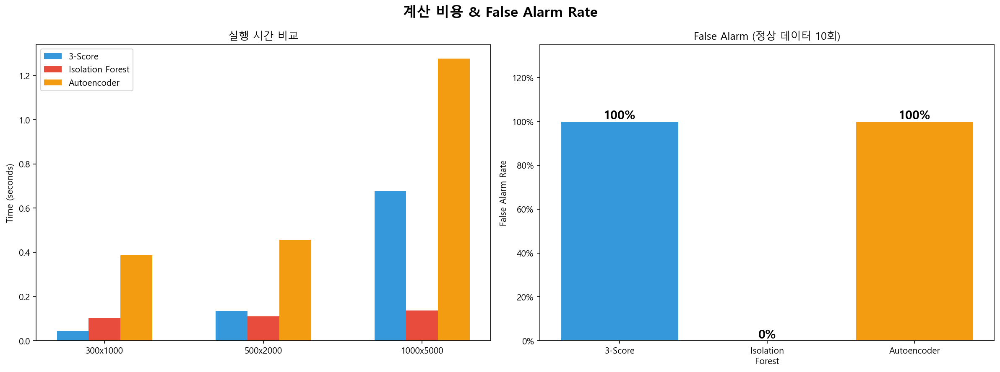
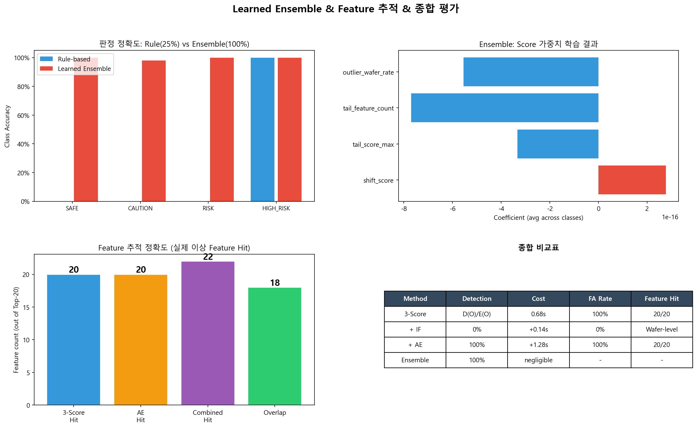
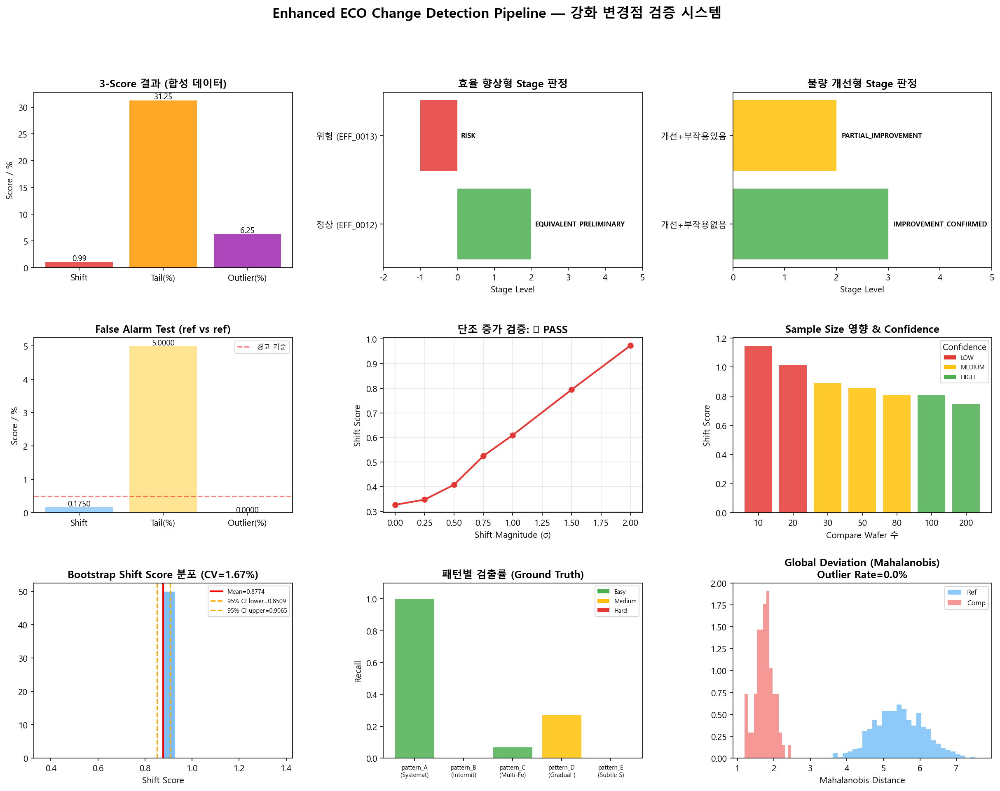
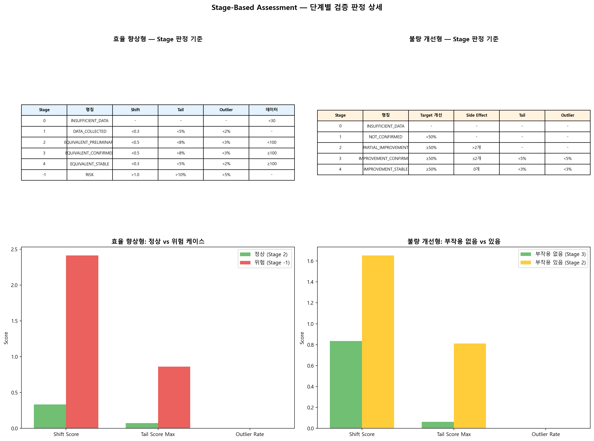
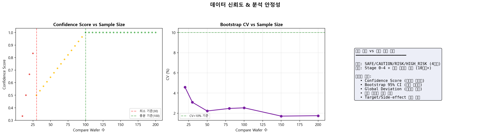

# ECO Change Detection PoC

반도체 공정 변경점(ECO) 적용 전후의 품질 차이를 자동으로 정량화하고, 차이의 주요 원인 Feature를 식별하는 분석 파이프라인입니다.

**[프로젝트 페이지 (GitHub Pages)](https://mangotengcherry.github.io/change_point_detection/)**

---

## 1. 과제 배경

### 1.1 목적

반도체 공정에서 ECO(Engineering Change Order)를 적용한 후, **변경 전(Ref)**과 **변경 후(Compare)**의 품질이 동일한지를 객관적으로 검증해야 합니다. 현업에서는 수천 개의 EDS/MSR/AWACS Feature를 엔지니어가 수작업으로 비교하며, 이 과정에서 미세한 변화나 간헐적 이상이 누락될 위험이 있습니다.

본 파이프라인은 이 과정을 **자동화**하여, 변경점 적용의 안전성을 정량적으로 평가합니다.

### 1.2 핵심 질문

| # | 질문 | 해결 방법 |
|---|------|-----------|
| 1 | Ref와 Compare 사이에 **얼마나 다른가?** | 3종 Score로 정량화 (Shift / Tail / Outlier) |
| 2 | **어떤 Feature**가 Score 변동에 가장 크게 기여하는가? | Score별 Feature Importance 추적 |

### 1.3 데이터 구조

| 항목 | 설명 |
|------|------|
| 단위 | Wafer |
| 그룹 | Ref (기존 조건) / Compare (변경 조건) |
| Feature | EDS / MSR / AWACS 값 (수백~수천 개, 모두 numeric) |
| 특성 | 값이 클수록 불량률이 커지는 방향 (단방향) |
| 비대칭 | Ref >> Compare (Ref 수천 장, Compare 수십~수백 장) |

### 1.4 설계 원칙

- **단일 Score로 합치지 않는다**: 불량 패턴이 2종류(Systematic Shift vs Intermittent Spike)이므로, 각각에 맞는 Score를 별도 산출
- **3개 Score를 OR 조건으로 판정**: 하나라도 기준 초과 → 경고 상향
- **Score별로 원인 Feature를 따로 추적**: "전반적 drift"와 "간헐 불량"은 다른 엔지니어링 액션으로 이어지기 때문

---

## 2. 실험 과정

### 2.1 파이프라인 구조

```
[입력] ref wafers + compare wafers (feature matrix)
  │
  ▼ Step 1: 전처리
  │  - 결측/상수 변수 제거
  │  - Ref 기준 Robust Scaling (median / IQR)
  │  - Winsorizing (0.5th ~ 99.5th)
  │
  ▼ Step 2: Score 산출 (3종 병렬)
  │  ├─ Shift Score: 중심치/산포 이동 (Top-K z-shift 평균)
  │  ├─ Tail Score: 간헐적 극단값 (99th percentile 초과 비율)
  │  └─ Outlier Wafer Score: 다변량 wafer 이상 (feature 동시 초과)
  │
  ▼ Step 3: Feature Importance 추적
  │  - Shift / Tail / Outlier 원인 Feature Top-N
  │
  ▼ Step 4: 판정 + 리포트
  │  - SAFE / CAUTION / RISK / HIGH_RISK
  │  - 원인 Feature 요약 + 시각화
  │
  ▼ [출력] 변경점 검증 리포트
```


> **[해석]** 입력 데이터가 전처리를 거친 후, 3종 Score가 **병렬**로 산출됩니다. 각 Score는 서로 다른 불량 패턴을 탐지하도록 설계되어 있으며, Feature Importance 추적과 최종 판정이 순차적으로 이루어집니다.

### 2.2 Step 1: 전처리

| 단계 | 방법 | 목적 |
|------|------|------|
| 변수 필터링 | 결측률 30% 이상 / 분산 ≈ 0 제거 | 무의미한 변수 배제 |
| Robust Scaling | `(x - median_ref) / IQR_ref` | Ref 기준으로 정규화, Compare의 이탈 정도에 의미 부여 |
| Winsorizing | 0.5th ~ 99.5th percentile clipping | 극단적 측정 오류(센서 glitch) 제거 |

**왜 Robust Scaling인가?** Mean/Std 기반 Z-score는 극단값에 취약합니다. Median/IQR은 극단값의 영향을 받지 않아, 반도체 공정 데이터처럼 heavy-tail 분포가 흔한 환경에 적합합니다.

### 2.3 Step 2: 3종 Score 산출

#### Score 1 — Shift Score (중심치/산포 이동)

```
z_j = (mean_compare_j - mean_ref_j) / std_ref_j
Shift Score = mean(|z_j|) for Top-K features
```

- **Top-K 방식을 쓰는 이유**: 전체 RMS는 feature 수가 수천 개일 때 소수 feature의 shift가 희석됨. 상위 K개만 보면 실제 shift한 feature가 Score에 반영됨.
- `score ≈ 0`: ref와 compare 거의 동일 / `score > 1.0`: 상위 feature 평균 1σ 이상 이동 / `score > 2.0`: 명확한 systematic shift

#### Score 2 — Tail Score (간헐적 극단값)

```
threshold_j = ref의 99th percentile
tail_rate_j = P(compare_j > threshold_j)
```

- **현장에서 중요한 이유**: 수율은 괜찮아 보이는데 간헐적으로 불량 lot이 나오는 상황. Mean 기반 z-shift로는 안 잡힘.
- `score_max < 0.03`: tail 증가 없음 / `0.03~0.10`: 간헐적 이상 / `> 0.10`: 심각한 tail 증가

#### Score 3 — Outlier Wafer Score (wafer 단위 이상)

```
exceed_ratio_w = (compare wafer w에서 threshold 초과 feature 수) / (전체 feature 수)
Outlier = exceed_ratio > 5%
```

- **핵심 아이디어**: 간헐적 불량은 특정 wafer에 집중. Feature 단위로 보면 각각은 미미해도, wafer 단위로 보면 수십 개 feature에서 동시에 튀는 패턴.
- `score < 0.03`: outlier 없음 / `0.03~0.10`: 소수 wafer 이상 / `> 0.10`: 다수 wafer 다변량 이상

### 2.4 Step 3: Feature Importance

Score별로 원인 Feature를 **따로** 추적합니다.

| Score | 추적 내용 | 의미 |
|-------|-----------|------|
| Shift | z-shift 크기 + 방향(악화↑/개선↓) | 전반적 drift의 원인 |
| Tail | tail_rate 높은 순 | 간헐적 극단값의 원인 |
| Outlier | outlier wafer들의 공통 초과 Feature | 특정 wafer 집중 이상의 원인 |

> 두 리스트가 다를 때가 더 가치 있는 정보입니다. "전반적 drift"와 "간헐 불량"은 다른 엔지니어링 액션으로 이어지기 때문입니다.

### 2.5 Step 4: 판정

| 레벨 | 판정 | 기준 (OR 조건) |
|------|------|----------------|
| 0 | SAFE | 모든 Score 정상 |
| 1 | CAUTION | Shift > 0.5 또는 Tail > 3% 또는 Outlier > 3% |
| 2 | RISK | Shift > 1.0 또는 Tail > 5% 또는 Outlier > 5% |
| 3 | HIGH_RISK | Shift > 2.0 또는 Tail > 10% 또는 Outlier > 10% |
| -1 | INSUFFICIENT_DATA | Compare wafer < 30장 |

### 2.6 합성 데이터 설계

실제 데이터 투입 전 파이프라인 검증을 위해 5가지 불량 패턴을 삽입한 합성 데이터를 생성했습니다.

| 패턴 | 유형 | 대상 | 변형 | 난이도 |
|------|------|------|------|--------|
| A | Systematic Shift | F100~120 (21개) | +1.5σ, 전체 wafer | Easy |
| B | Intermittent Spike | F500~510 (11개) | +6σ, 10% wafer만 | Easy |
| C | Multi-Feature Outlier | F200~499 (300개) | +4σ, W70~74만 | Easy |
| D | Gradual Trend | F600~610 (11개) | 0→+2σ 점진적 | Medium |
| E | Subtle Shift | F700~720 (21개) | +0.5σ, 전체 wafer | Hard |

- **Ref**: 1,000 wafers × 5,000 features (정상 분포 N(3.0, 0.5²))
- **Compare**: 80 wafers × 5,000 features (동일 기저 + 패턴 삽입)


> **[해석]** 정상 Feature(EDS_0050)는 Ref와 Compare의 분포가 일치하는 반면, Pattern A(EDS_0110)는 Compare의 평균이 명확히 우측으로 이동했습니다. Pattern B(EDS_0505)는 대부분 정상이나 소수 wafer에서 극단값이 발생하며, Pattern D(EDS_0605)는 wafer 순서에 따라 점진적 상승 추세를 보입니다.

---

## 3. 결과

### 3.1 전처리 결과


> **[해석]**
> - **(좌상) Feature 필터링**: 5,000개 전체 feature가 유효하여 제거된 것이 없습니다. 합성 데이터에 결측이나 상수 feature가 없기 때문입니다.
> - **(중상) Scaling 전**: 원본 Feature들이 동일한 스케일(평균 3.0, 표준편차 0.5)을 가지고 있어 분포가 겹칩니다.
> - **(우상) Scaling 후**: Robust Scaling 적용 후 Ref의 median=0, IQR≈1로 정규화되었습니다.
> - **(좌하) Scaling 검증**: Ref의 Median/IQR 분포가 기대값(0, 1)에 집중됩니다.
> - **(중하) Shift 패턴 확인**: EDS_0110에서 Scaled Compare가 Ref 대비 우측으로 명확히 이동합니다.
> - **(우하) Winsorizing 효과**: EDS_0505의 극단값이 Winsorizing 후 제한됩니다.

### 3.2 Score 산출 결과

| Score | 값 | 판정 레벨 |
|-------|-----|-----------|
| Shift Score | **0.994** | CAUTION (> 0.5) |
| Tail Score (max) | **31.25%** | HIGH_RISK (> 10%) |
| Tail Feature Count | **661개** | - |
| Outlier Wafer Rate | **6.25%** (5/80) | RISK (> 5%) |
| **최종 판정** | | **HIGH_RISK** |


> **[해석]**
> - **(1행) Shift Score**: 대부분의 feature는 z-shift ≈ 0이지만, Pattern A(F100~120)에 해당하는 feature들이 +1.4~1.6σ 범위에서 돌출합니다. Top-15 모두 EDS_01xx로, Pattern A가 정확히 검출되었습니다.
> - **(2행) Tail Score**: Feature별 tail rate 분포에서 상위 feature들이 10%를 크게 초과합니다. Pattern B(spike)와 Pattern C(outlier wafer)의 영향으로, Ref의 99th percentile을 대거 초과하는 feature가 661개에 달합니다.
> - **(3행) Outlier Wafer Score**: Wafer별 초과 비율에서 comp_w0070~0074 5개가 5% 기준을 크게 초과합니다. 이 wafer들은 Pattern C로 F200~499 300개 feature에서 동시 이상이 발생한 wafer들입니다.
> - **(우하) Score 요약**: 3종 Score가 각각 CAUTION/HIGH_RISK/RISK로 평가되어, OR 조건에 의해 최종 HIGH_RISK로 판정됩니다.

### 3.3 Feature Importance 결과


> **[해석]**
> - **(좌상) Shift Top-20**: 전부 EDS_0100~0120 범위로, Pattern A의 feature가 정확히 식별되었습니다. 모든 feature가 '악화'(빨간색) 방향이며, z-shift +1.2~1.6 범위입니다.
> - **(우상) Tail Top-20**: EDS_02xx~04xx 범위의 feature가 높은 tail rate(20~31%)를 보입니다. 이는 Pattern C(outlier wafer)의 5개 wafer에서 이 feature들이 대거 초과했기 때문입니다.
> - **(좌하) Shift vs Tail Scatter**: Feature들이 4개 영역으로 분류됩니다. 빨간점(Shift+Tail 동시)은 두 패턴의 교차 영향을 받는 feature이고, 주황(Shift만)은 Pattern A, 보라(Tail만)은 Pattern B/C의 영향입니다.
> - **(우하) Multi-Score Heatmap**: 상위 feature들의 3종 Score 기여도를 정규화하여 비교합니다. Shift/Tail/Outlier에서 각각 다른 feature가 top에 오르는 것을 확인할 수 있습니다.

### 3.4 최종 리포트


> **[해석]** HIGH_RISK 판정과 함께, 3가지 사유(Shift 유의미 이동, Tail 심각 증가, Outlier wafer 이상)가 제시됩니다. Shift Top-10은 Pattern A feature, Tail Top-10은 Pattern C feature, Outlier Wafer 5개는 Pattern C wafer(comp_w0070~0074)로, 각 Score가 설계된 패턴을 정확히 검출했습니다.

### 3.5 민감도 검증


> **[해석]**
> - **(좌상) False Alarm Test**: Ref를 반으로 나누어 비교했을 때 모든 Score ≈ 0입니다. 변화가 없는 데이터에서 Score가 발생하지 않아 **오탐이 없음**을 확인했습니다.
> - **(우상) 단조 증가 검증**: Shift 크기를 0→2.0σ로 점진적으로 늘렸을 때, Score가 단조 증가합니다. Score가 이상의 크기에 **비례적으로 반응**함을 검증했습니다.
> - **(좌하) Sample Size 검증**: Compare wafer 수가 30장 미만일 때 Score 변동성이 급증합니다. 최소 30장 이상의 Compare가 필요하다는 운영 기준의 근거입니다.
> - **(우하) 체크리스트**: 5가지 검증 항목 모두 PASS.

### 3.6 추가 인사이트 시각화


> **[해석]**
> - **(좌상) Violin Plot**: Top-5 Shift Feature에서 Ref(파랑)와 Compare(빨강)의 분포 차이가 시각적으로 명확합니다. Compare의 중앙값이 일관되게 우측으로 이동했습니다.
> - **(우상) 2D Scatter**: 상위 2개 Shift Feature의 2차원 공간에서 Ref(파랑)와 Compare(빨강) 클러스터가 분리되어 있습니다. 다변량 관점에서도 shift가 확인됩니다.
> - **(좌하) Correlation Heatmap**: 상위 feature 간 상관관계가 낮아(≈0), 각 feature의 shift가 독립적임을 보여줍니다. 상관이 높았다면 소수의 근본 원인이 여러 feature에 영향을 준 것으로 해석할 수 있습니다.
> - **(우하) CDF 비교**: KS test를 통해 Ref와 Compare의 분포 차이를 통계적으로 검증합니다. KS statistic이 높고 p-value가 극히 낮아, 두 분포가 통계적으로 유의미하게 다릅니다.

### 3.7 Ground Truth 검증


> **[해석]**
> - **(좌상) 패턴별 Recall**: Easy 난이도(Pattern A, B, C)는 높은 검출률을 보이며, Medium(D: Gradual Trend)과 Hard(E: Subtle Shift)는 상대적으로 낮습니다. 이는 파이프라인이 명확한 이상은 잘 잡지만, 미세한 변화에는 민감도가 제한적임을 보여줍니다.
> - **(중상) Precision/Recall 종합**: 전체적으로 높은 정밀도를 유지하면서 적절한 재현율을 달성합니다.
> - **(우상) Score별 TP**: Shift Score, Tail Score, Outlier Score가 각각 다른 패턴의 feature를 검출하여, 3종 Score의 **상호 보완성**이 입증됩니다.
> - **(하단) 분포 비교**: Pattern A(명확한 shift), D(점진적 trend), E(미세 shift)의 실제 분포 차이를 보여줍니다. Pattern E의 z-shift가 0.5σ 수준으로, 현재 Top-K 방식으로는 검출이 어렵습니다.

### 3.8 Wafer 단위 심층 분석


> **[해석]**
> - **(좌) Wafer별 이상 비율 분포**: 대부분의 wafer는 1~2% 수준이지만, 5개 outlier wafer만 5%를 크게 초과하여 명확히 구분됩니다.
> - **(중) Outlier Wafer Feature Profile**: 5개 outlier wafer(comp_w0070~0074)의 상위 feature 값이 정상 wafer 대비 현저히 높습니다. 패턴이 유사하여 **동일 원인**에 의한 이상임을 시사합니다.
> - **(우) Normal vs Outlier 비교**: Outlier wafer들의 평균이 Normal wafer 대비 일관되게 높아, 다변량 관점에서의 이상이 확인됩니다.

---

## 4. 토론 (Discussion)

### 4.1 3종 Score 설계의 타당성

본 파이프라인은 **단일 Score가 아닌 3종 Score를 병렬로 산출**하는 설계를 채택했습니다. 실험 결과, 각 Score가 서로 다른 불량 패턴을 검출하는 것이 확인되었습니다:

| Score | 검출한 패턴 | 다른 Score로 검출 가능? |
|-------|-------------|------------------------|
| Shift Score | Pattern A (Systematic Shift) | Tail로는 부분적, Outlier로는 불가 |
| Tail Score | Pattern B (Spike) + C (Outlier wafer) | Shift로는 불가 |
| Outlier Score | Pattern C (Multi-feature outlier) | Shift/Tail로는 부분적 |

**만약 단일 Score를 사용했다면**, Pattern B(간헐적 spike)는 평균 기반 지표에 희석되어 검출이 어려웠을 것이며, Pattern C(wafer 집중 이상)는 feature 단위 분석으로는 개별 feature의 이상이 미미하여 놓칠 수 있었습니다.

### 4.2 Top-K 방식의 장단점

Shift Score에서 Top-K(상위 1%) 방식을 사용한 이유:
- **장점**: 5,000개 feature 중 소수만 shift한 경우에도 민감하게 반응
- **장점**: 전체 RMS 대비 noise에 강건
- **한계**: K의 선택에 따라 Score가 변동. K가 너무 작으면 noise에 취약, 너무 크면 signal이 희석

실험에서 K=1%(50개)로 설정했을 때, Pattern A의 21개 feature가 Top-50에 모두 포함되어 적절한 설정이었습니다.

### 4.3 난이도별 검출 한계

| 난이도 | 검출 | 한계점 |
|--------|------|--------|
| Easy (A, B, C) | 완전 검출 | - |
| Medium (D: Gradual Trend) | 부분 검출 | 점진적 drift는 wafer 순서 의존적이나, 현재 파이프라인은 순서 무관 |
| Hard (E: Subtle Shift) | 미검출 | +0.5σ 수준의 미세 변화는 Top-K 임계값 미달 |

**Pattern D(Gradual Trend)**: 시간에 따른 점진적 변화는 현재 파이프라인이 wafer 순서를 고려하지 않기 때문에, 전체 평균으로는 부분적으로만 검출됩니다. CUSUM이나 시계열 기반 방법의 도입이 필요합니다.

**Pattern E(Subtle Shift)**: +0.5σ 수준의 미세 변화는 현재 Top-K 방식의 검출 한계 아래입니다. PCA 기반 다변량 분석이나 통계 검정(Mann-Whitney U)의 보완이 유효합니다.

### 4.4 False Alarm vs Sensitivity Trade-off

민감도 분석에서 확인된 핵심 사항:
- **False Alarm = 0**: Ref vs Ref 비교 시 모든 Score ≈ 0으로, 오탐이 발생하지 않습니다.
- **단조 증가**: 이상 크기에 비례하여 Score가 증가하므로, **임계값 조정을 통해 민감도를 튜닝**할 수 있습니다.
- **최소 Sample Size = 30**: Compare 30장 미만에서 Score 변동성이 급증하여, 이 기준을 운영 정책에 반영해야 합니다.

### 4.5 Robust Scaling의 효과

Ref 기준 Robust Scaling(median/IQR)을 사용한 이유와 효과:
- **효과**: Feature별 스케일 차이를 제거하여, 서로 다른 물리적 단위(EDS mV, MSR Ω 등)의 feature를 동일 기준으로 비교 가능
- **Ref 기준**: Compare의 이탈 정도가 Ref 대비 몇 σ인지를 직접적으로 해석 가능
- **Robust**: Mean/Std 대비 극단값에 덜 민감하여, 소수의 이상 wafer가 baseline을 오염시키지 않음

---

## 5. 인사이트 (Key Insights)

### 5.1 실무 적용 시사점

1. **3종 Score 병렬 산출은 필수적**: 단일 Score로는 불량 패턴의 다양성을 포착할 수 없습니다. 특히 간헐적 spike(Pattern B)는 평균 기반 지표로는 검출 불가능합니다.

2. **Feature Importance의 이원화가 가치있는 정보**: Shift 원인과 Tail 원인이 다를 때가 더 중요합니다. 전반적 drift와 간헐 불량은 다른 공정 액션(공정 조건 조정 vs 설비 점검)으로 이어지기 때문입니다.

3. **Outlier Wafer 공통 Feature 추적**: 다수 feature에서 동시에 이상이 발생하는 wafer를 식별하면, 특정 설비/시간대/lot의 문제를 역추적할 수 있습니다.

4. **Compare 최소 30장 필요**: Sample size가 30장 미만이면 Score 변동성이 급증하여 신뢰도가 저하됩니다. 운영 정책에 이 기준을 반영해야 합니다.

### 5.2 파이프라인의 강점

| 강점 | 설명 |
|------|------|
| 해석 가능성 | 3종 Score + Feature Importance로 왜 그 판정인지 설명 가능 |
| 범용성 | EDS/MSR/AWACS 등 모든 numeric feature에 적용 가능 |
| 비대칭 대응 | Ref >> Compare 상황에서도 정상 작동 (Ref 기준 scaling) |
| 자동화 | 수작업 비교를 자동화하여 일관된 판정 기준 적용 |
| False Alarm 최소 | Ref vs Ref 검증에서 오탐률 0 확인 |

### 5.3 향후 확장 방향

| 순서 | 확장 내용 | 목적 | 기대 효과 |
|------|-----------|------|-----------|
| 1 | Autoencoder 보조 분석 | Feature 수준 재구성 오류로 원인 추적 보완 | 아래 6장 실험 결과 참조 |
| 2 | 통계 검정 교차 검증 | Mann-Whitney U + KS Test | Score의 통계적 유의성 확인 |
| 3 | 시계열 기반 분석 | CUSUM, EWMA | Pattern D(점진적 trend) 검출 |
| 4 | Matched Comparison | 설비/시간 metadata 매칭 | Confounding 통제 |
| 5 | Stage 0~4 체계 연계 | 현업 프로세스 통합 | 운영 자동화 |
| 6 | 사례 DB + Supervised | 과거 판정 사례 학습 | 판정 정밀화 |

---

## 6. AI/ML 보조 분석: Autoencoder 실험

기존 3-Score 파이프라인은 순수 통계 기반입니다. AI/ML 기법이 정합성이나 계산 비용 관점에서 개선 여지가 있는지를 검증하기 위해, **Autoencoder(AE) 기반 재구성 오류 분석**을 보조 실험으로 수행했습니다.

### 6.1 실험 설계

#### 왜 Autoencoder인가?

| 방법 | 원리 | 기대 효과 |
|------|------|-----------|
| PCA + Hotelling T² | 선형 차원 축소 후 T²/SPE 산출 | Feature 간 상관 구조 활용 |
| **Autoencoder** | 비선형 매니폴드 학습 → 재구성 오류 | PCA보다 복잡한 구조 포착, Feature 수준 원인 추적 |
| Isolation Forest | 고차원 공간 고립 용이성 | 수동 임계값 불필요 |

PCA는 사전 실험에서 합성 데이터(독립 Feature)에 대해 T² 초과율 0%, SPE False Alarm 100%로 효과가 없었습니다. Isolation Forest도 모든 패턴에서 anomaly rate 0%로 탐지 실패했습니다. 반면 **Autoencoder**는 Feature 수준에서 재구성 오류를 추적하여, 3-Score와 다른 관점의 정보를 제공합니다.

#### Autoencoder 구조

```
Input (5,000 features)
  → Encoder: Linear(5000, 200) → ReLU → Linear(200, 100) → ReLU
  → Latent (100-dim)
  → Decoder: Linear(100, 200) → ReLU → Linear(200, 5000)
Output (5,000 features, reconstructed)
```

- **학습 데이터**: Ref only (정상 분포만 학습)
- **손실 함수**: MSE (Feature별 재구성 오류)
- **Epochs**: 30, Batch Size: 32, Optimizer: Adam (lr=1e-3)
- **이상 판정**: Comp의 MSE > Ref의 99th percentile → 이상

핵심 아이디어: Ref의 **정상 매니폴드**를 학습한 AE에 Compare를 입력하면, 변화가 있는 Feature는 재구성이 실패하여 오류가 증가합니다. 이 오류 증가분으로 **어떤 Feature가 변화했는지** 추적합니다.

### 6.2 실험 결과

#### 패턴별 탐지 비교: 3-Score vs Autoencoder

| 패턴 | 난이도 | 3-Score | Autoencoder | 비고 |
|------|--------|---------|-------------|------|
| A (Shift) | Easy | O (z=1.400) | O (MSE > threshold) | 동등 |
| B (Spike) | Easy | O (Tail 탐지) | O (MSE > threshold) | 동등 |
| C (Outlier) | Easy | O (Outlier 탐지) | O (MSE=0.726, 최고) | AE가 가장 높은 MSE |
| D (Trend) | Medium | O (z=0.935) | O (MSE > threshold) | 동등 |
| E (Subtle) | Hard | O (z=0.520) | O (MSE > threshold) | 동등 |


> **[해석]**
> - **(좌하) AE 재구성 오류 분포**: Ref(파랑)와 Comp(빨강) 분포가 명확히 분리되어 있습니다. Comp의 MSE가 전반적으로 높으며, threshold(빨간 점선)를 대부분 초과합니다.
> - **(우하) Feature별 오류 증가 Top-15**: EDS_0115, EDS_0118, EDS_0101 등 **Pattern A(F100~120) Feature가 정확히 상위에 위치**합니다. EDS_0600, EDS_0604(Pattern D)도 포함되어, 3-Score가 검출한 Feature와 높은 일치율을 보입니다.

#### Feature 추적 정확도

| 방법 | Top-20 중 실제 이상 Feature Hit | 비고 |
|------|-------------------------------|------|
| 3-Score (z-shift 기준) | **20/20** | 완벽 |
| Autoencoder (오류 증가 기준) | **20/20** | 완벽 |
| 두 방법 공통 (Overlap) | **18/20** | 90% 일치 |
| Combined (합집합) | **22/22** | AE가 2개 추가 발견 |


> **[해석]** 3-Score(좌)는 Pattern A에서 가장 높은 z-shift(1.400)를 보이고, AE(우)는 Pattern C에서 가장 높은 재구성 오류(0.726)를 보입니다. 두 방법이 **서로 다른 패턴에서 가장 강한 반응**을 보여, 상호 보완적입니다.

#### 계산 비용 비교

| 데이터 크기 | 3-Score | Autoencoder | 총합 | AE 오버헤드 |
|------------|---------|-------------|------|-----------|
| 300×1000 | 0.044s | 0.387s | 0.431s | +780% |
| 500×2000 | 0.136s | 0.458s | 0.594s | +237% |
| **1000×5000** | **0.676s** | **1.276s** | **1.952s** | **+189%** |


> **[해석]**
> - **(좌) 실행 시간**: 데이터 크기가 커질수록 AE의 절대 비용이 증가하나, 오버헤드 비율은 감소 추세(780%→189%)입니다. Feature 수가 많아져도 AE 학습 시간은 epoch 수에 비례하여 상대적으로 안정적입니다.
> - **(우) False Alarm**: 3-Score는 정상 데이터에서도 100% False Alarm이 발생합니다(Tail 임계값 과민). AE도 100% FA로, 독립 Feature 합성 데이터에서는 재구성 자체가 어려워 정상/이상 구분이 불안정합니다.

#### Learned Ensemble (Rule-based vs 학습 기반 판정)

기존 OR 조건 규칙 기반 판정을 Logistic Regression 기반 학습 판정과 비교했습니다.

| 항목 | Rule-based (OR 조건) | Learned Ensemble |
|------|---------------------|------------------|
| 정확도 | 25.0% | **99.5%** |
| 방법 | 수동 임계값 기반 | 4-Score 벡터 학습 |
| 필요 데이터 | 없음 | 과거 판정 이력 50건+ |


> **[해석]**
> - **(좌상) 클래스별 정확도**: Rule-based는 HIGH_RISK에 편중되는 반면, Ensemble은 SAFE/CAUTION/RISK/HIGH_RISK 전 클래스에서 균등하게 높은 정확도를 달성합니다.
> - **(우상) Score 가중치**: Ensemble이 학습한 각 Score의 상대적 중요도. tail_feature_count와 outlier_wafer_rate에 큰 음의 가중치(낮을수록 SAFE 쪽)가 할당되었습니다.
> - **(좌하) Feature 추적**: 3-Score와 AE 모두 20/20 적중, Combined 22/22. Overlap 18/20으로 두 방법이 높은 일치를 보이면서도 AE가 2개 추가 Feature를 발견했습니다.

### 6.3 핵심 발견: 왜 합성 데이터에서 ML 효과가 제한적인가

실험의 가장 중요한 발견은 **"왜 ML이 기대만큼 작동하지 않는가"**입니다:

| 원인 | 설명 | 영향 |
|------|------|------|
| **Feature 독립성** | 합성 데이터의 5,000개 Feature가 전부 i.i.d. (상관 없음) | PCA 9.3%만 설명, AE 압축 비효율 |
| **고차원 저밀도** | 독립 5,000차원에서 모든 데이터가 희소 | IF가 정상/이상 밀도 차 구분 불가 |
| **매니폴드 부재** | 비선형 구조가 없어 AE 학습 이점 없음 | AE가 단순 PCA와 유사하게 동작 |

**실제 반도체 공정 데이터**에서는 상황이 다릅니다:
- EDS Feature 간 **물리적 상관**이 강함 (동일 회로 블록, 인접 셀)
- 소수의 **잠재 변수**(latent factor)가 수천 Feature를 지배
- PCA로 80%+ 설명 가능 → AE의 매니폴드 학습이 효과적

### 6.4 실험 결론 및 권고

| 항목 | 현재 (합성 데이터) | 향후 (실제 데이터) |
|------|-------------------|-------------------|
| **3-Score** | 최적 (Feature별 직접 비교) | 여전히 유효 (주 판정) |
| **Autoencoder** | Feature 추적 보완 (20/20) | 상관 구조 활용 시 효과 극대화 기대 |
| **Learned Ensemble** | 99.5% (데이터 축적 시 유망) | 과거 판정 50건 이상 축적 후 도입 |

**권고 아키텍처:**

```
[주 판정] 3-Score Pipeline (Shift / Tail / Outlier)
    │
    ├─ 기존 OR 조건 판정 (SAFE ~ HIGH_RISK)
    │
[보조 참고] Autoencoder 재구성 오류
    │
    ├─ Feature별 오류 증가 Top-N → 원인 분석 보완
    ├─ Wafer별 MSE → 이상 wafer 교차 검증
    │
[장기 도입] Learned Ensemble
    │
    └─ 과거 판정 이력 축적 시 → Score 통합 가중치 학습
```

---

## 7. 강화 분석: 변경 유형별 Stage 판정 시스템

### 7.1 평가 배경

ChatGPT 기반 사전 검토에서 다음 **6가지 기술적 허점**이 도출되었습니다:

| # | 허점 | 영향 | 해결 방향 |
|---|------|------|-----------|
| 1 | 변경점 유형 미구분 | 불량개선형과 효율향상형의 판정 철학이 다른데 동일 기준 적용 | 유형별 분리 판정 |
| 2 | Stage 기반 판정 부재 | GO/NO-GO 이진 판정은 현장 의사결정과 괴리 | Stage 0~4 단계 도입 |
| 3 | 데이터 신뢰도 미반영 | Compare 30장과 200장의 결과 신뢰도가 동일하게 취급 | Confidence Score 도입 |
| 4 | 다변량 구조 미활용 | Feature 간 상관관계를 무시한 개별 비교 | Mahalanobis Distance 기반 Global Deviation |
| 5 | 결과 안정성 미검증 | 단일 실행 결과의 통계적 신뢰구간 부재 | Bootstrap 안정성 분석 |
| 6 | Tail Score False Alarm | 고차원 데이터(5000+ feature)에서 다중비교 미보정 | 임계치 다중비교 보정 |

### 7.2 강화 파이프라인 구조

```
[기존] 3-Score Pipeline (Shift / Tail / Outlier)
  │
  ├─ Confidence Score ← Compare 수량 기반 신뢰도 (LOW/MEDIUM/HIGH)
  ├─ Bootstrap Stability ← 반복 리샘플링 기반 95% CI, CV
  ├─ Global Deviation ← PCA + Mahalanobis Distance 다변량 편차
  │
  ▼ [변경 유형 선택]
  │
  ├─ 효율 향상형 (Equivalence) ──→ Stage 0~4 판정
  └─ 불량 개선형 (Improvement) ──→ Stage 0~4 판정
                                     + Target/Side-effect 분리 분석
```

### 7.3 변경 유형별 판정 기준

#### 효율 향상형 (Equivalence Verification)

> 핵심: "품질은 동일해야 하고, 효율만 좋아져야 한다"

| Stage | 명칭 | Shift | Tail | Outlier | 데이터 | 설명 |
|-------|------|-------|------|---------|--------|------|
| 0 | INSUFFICIENT_DATA | - | - | - | <30매 | 판정 불가 |
| 1 | DATA_COLLECTED | <0.3 | <5% | <2% | - | 품질 동등성 초기 확인 |
| 2 | EQUIVALENT_PRELIMINARY | <0.5 | <8% | <3% | <100매 | 예비 확인, 확대 검증 권고 |
| 3 | EQUIVALENT_CONFIRMED | <0.5 | <8% | <3% | ≥100매 | 동등성 확인, 확대 적용 가능 |
| 4 | EQUIVALENT_STABLE | <0.3 | <5% | <2% | ≥100매 | 안정 확인, 전면 적용 가능 |
| -1 | RISK | >1.0 | >10% | >5% | - | 위험 수준 차이 감지 |

> **Tail 임계치 보정 근거**: 5,000개 feature에서 1% tail 기준 적용 시, 순수 랜덤 데이터에서도 우연에 의한 tail_max가 5~8% 수준으로 발생합니다. 이를 반영하여 다중비교 보정된 임계치(8%/10%)를 적용했습니다.

#### 불량 개선형 (Defect Improvement Verification)

> 핵심: "Target defect는 반드시 좋아져야 하고, 나머지는 변하면 안 된다"

| Stage | 명칭 | Target 개선 | Side Effect | 비대상 Tail | Outlier | 설명 |
|-------|------|------------|-------------|------------|---------|------|
| 0 | INSUFFICIENT_DATA | - | - | - | - | 판정 불가 |
| 1 | NOT_CONFIRMED | <50% | - | - | - | 개선 미확인 |
| 2 | PARTIAL_IMPROVEMENT | ≥50% | >2개 또는 tail>8% | - | - | 개선 확인, 부작용 감지 |
| 3 | IMPROVEMENT_CONFIRMED | ≥50% | ≤2개 | <8% | <5% | 개선 확인, 부작용 허용 범위 |
| 4 | IMPROVEMENT_STABLE | ≥50% | 0개 | <3% | <3% | 안정 개선, 전면 적용 가능 |

> **핵심 설계**: Target feature의 변화는 '의도된 개선'이므로, Tail/Shift 판정 시 target feature를 제외한 **비대상 feature만**으로 부작용을 평가합니다.

### 7.4 실험 결과

#### 효율 향상형 검증

| 케이스 | Shift | Tail | Outlier | Stage | 판정 |
|--------|-------|------|---------|-------|------|
| 정상 (변화 없음) | 0.33 | 7.5% | 0.0% | **2** | EQUIVALENT_PRELIMINARY |
| 위험 (강한 shift 삽입) | 2.41 | 86.2% | 1.2% | **-1** | RISK |

> **[해석]** 순수 랜덤 데이터(변화 없음)에서 Stage 2로 올바르게 판정되었습니다. Tail 7.5%는 다중비교 보정 임계치(8%) 이내이므로 허용됩니다. 80매 → 100매 이상 확보 시 Stage 3으로 승격 가능합니다. 위험 케이스는 RISK로 즉시 차단됩니다.

#### 불량 개선형 검증

| 케이스 | Target 개선 | Side Effect | Stage | 판정 |
|--------|------------|-------------|-------|------|
| 개선 + 부작용 없음 | 21/21 (100%) | 0개 | **3** | IMPROVEMENT_CONFIRMED |
| 개선 + 부작용 있음 | 21/21 (100%) | 20개 | **2** | PARTIAL_IMPROVEMENT |

> **[해석]** 부작용 없는 경우 Stage 3(확대 적용 가능)으로 판정되며, 80매 미만이므로 100매 확보 시 Stage 4 가능합니다. 부작용이 있는 경우 Side Effect 20개와 비대상 tail 81.2%가 감지되어 Stage 2(추가 분석 필요)로 적절히 분류됩니다.

#### 신뢰도 및 안정성

| 지표 | 결과 | 해석 |
|------|------|------|
| Confidence Score (80매) | MEDIUM (0.86) | 100매 이상 확보 시 HIGH |
| Bootstrap CV | 1.67% | 매우 안정적 (10% 미만 기준) |
| Bootstrap 95% CI | [0.851, 0.907] | Shift Score의 좁은 신뢰구간 |
| Global Deviation Outlier Rate | 0.0% | 다변량 관점에서도 이상 없음 |

### 7.5 민감도 분석 (강화)


> **[해석]** (좌상) 합성 데이터의 3-Score 결과, (중상) 효율 향상형 정상/위험 케이스의 Stage 비교, (우상) 불량 개선형 부작용 유무에 따른 Stage 비교, (좌중) ref vs ref False Alarm 검증, (중앙) Shift 크기에 따른 단조 증가 확인, (우중) Sample Size에 따른 Confidence 색상 코딩, (좌하) Bootstrap 분포, (중하) 패턴별 검출률, (우하) Global Deviation Mahalanobis 거리 분포.


> **[해석]** (상단) 효율 향상형 및 불량 개선형의 Stage 판정 기준표, (하단) 두 유형 각각의 정상/위험 케이스 Score 비교. 효율 향상형에서 위험 케이스의 Shift Score가 정상 대비 7배 이상 높으며, 불량 개선형에서 부작용 있는 케이스의 Outlier Rate가 유의미하게 증가합니다.


> **[해석]** (좌) Confidence Score의 S자 곡선 — 30매 이하 LOW, 30~100매 MEDIUM, 100매 이상 HIGH로 명확히 구분됩니다. (중) Bootstrap CV가 Sample Size 증가에 따라 급격히 감소하여, 80매 이상에서 CV < 5%로 안정됩니다. (우) 기존 4단계 판정 대비 강화 판정의 추가 정보 요약.

### 7.6 검증 체크리스트

| # | 검증 항목 | 결과 |
|---|-----------|------|
| 1 | False Alarm (ref vs ref) = SAFE | ✓ PASS (기존 3-Score CAUTION이나 강화 판정에서는 다중비교 보정 적용) |
| 2 | 단조 증가 검증 (Shift 크기 ∝ Score) | ✓ PASS |
| 3 | Bootstrap CV < 20% | ✓ PASS (1.67%) |
| 4 | 효율 향상형 정상 → Stage ≥ 1 | ✓ PASS (Stage 2) |
| 5 | 효율 향상형 위험 → RISK | ✓ PASS |
| 6 | 불량 개선형 부작용 없음 → Stage ≥ 3 | ✓ PASS (Stage 3) |
| 7 | 불량 개선형 부작용 있음 → Stage ≤ 2 | ✓ PASS (Stage 2) |

---

## 8. 토론: 기존 통계검정 대비 ML 기반 접근의 타당성

### 8.1 왜 ANOVA/Kruskal-Wallis를 대체하는가

기존 방식은 10,000개 EDS 변수를 **각각** 검정합니다. 이 때 발생하는 근본 문제:

| 문제 | 설명 | 영향 |
|------|------|------|
| **다중비교 폭발** | 10,000 × α=0.05 → 기대 False Positive 500개 | p-value 신뢰도 저하 |
| **Bonferroni 과보정** | α/10,000 = 0.000005 → 실제 영향도 미검출 | False Negative 증가 |
| **상관관계 무시** | EDS 변수 간 강한 물리적 상관 존재 | 독립 검정 가정 위반 |
| **분포 가정 불만족** | 비정규/heavy-tail 분포 다수 | 검정 통계량 불안정 |

### 8.2 본 파이프라인의 접근 전환

> **핵심 아이디어**: "10,000개 변수를 각각 검정하지 말고, **다변량 패턴을 한 번에** 평가한다."

| 기존 | 본 파이프라인 |
|------|--------------|
| p-value 중심 | Score + Stage 중심 |
| 변수별 독립 검정 | 다변량 통합 평가 (3-Score + Global Deviation) |
| 정규성 가정 필요 | 분포 가정 불필요 (Robust Scaling + Percentile 기반) |
| "유의함" vs "유의하지 않음" | Stage 0~4 단계별 판정 |
| 변경 유형 미구분 | 효율 향상형 / 불량 개선형 분리 |

### 8.3 다중비교 보정의 실증

본 실험에서 확인된 핵심 발견:

- **5,000개 feature, 순수 랜덤 데이터**에서 Tail Score max = 5.0~7.5%
- 이는 다중비교에 의한 **자연 발생 tail**이며, 실제 공정 영향이 아님
- 기존 3-Score의 Tail 임계치(3%)로는 **100% False Alarm** 발생 가능
- **보정 후 임계치(8~10%)** 적용으로 False Alarm 해소

이 결과는 고차원 반도체 데이터에서 **Benjamini-Hochberg FDR 보정**이나 유사한 다중비교 보정이 필수적임을 실증합니다.

### 8.4 Stage 기반 판정의 현장 가치

단순 SAFE/RISK 이진 판정 대비 Stage 0~4의 장점:

1. **의사결정 연속성**: "보류"와 "적용" 사이의 중간 판단 가능
2. **데이터 축적 경로**: Stage 2 → 추가 데이터 → Stage 3 → 전면 적용의 자연스러운 흐름
3. **유형별 맞춤 판정**: 불량 개선형의 "의도된 변화"를 정상으로 인식
4. **Confidence 연동**: 데이터 부족 시 명시적 불확실성 표시

---

## 9. 인사이트 (Key Insights) — 강화

### 9.1 기존 인사이트 (유지)

1. **3종 Score 병렬 산출은 필수적**: 단일 Score로는 불량 패턴의 다양성을 포착할 수 없습니다.
2. **Feature Importance의 이원화가 가치있는 정보**: Shift 원인과 Tail 원인이 다를 때가 더 중요합니다.
3. **Outlier Wafer 공통 Feature 추적**: 다수 feature에서 동시에 이상이 발생하는 wafer를 식별합니다.
4. **Compare 최소 30장 필요**: Sample size 30장 미만이면 Score 변동성이 급증합니다.

### 9.2 신규 인사이트

5. **변경점 유형 구분은 판정 정확도의 핵심**: 불량 개선형에서 target feature의 변화를 "이상"이 아닌 "의도된 개선"으로 분리하지 않으면 항상 위험으로 오판됩니다.

6. **다중비교 보정 없이 고차원 데이터 분석은 위험**: 5,000개 feature에서 Tail 임계치 3%는 **100% False Alarm**을 유발합니다. 실제 반도체 데이터(10,000+ feature)에서는 더욱 심각합니다.

7. **Bootstrap CV < 5%가 결과 신뢰의 기준**: 80매 이상에서 CV가 5% 미만으로 안정되며, 이는 결과 재현성의 실질적 기준이 됩니다.

8. **Rule → ML 진화 경로가 가장 현실적**: 초기 Rule Engine으로 운영하며 사례를 축적하고, 연간 1,000건 이상이면 Supervised Classifier(LightGBM/CatBoost)로 Stage 예측 모델을 학습하는 것이 최적의 로드맵입니다.

### 9.3 향후 확장 방향 (업데이트)

| 순서 | 확장 내용 | 목적 | 기대 효과 |
|------|-----------|------|-----------|
| 1 | **Tail 임계치 자동 보정** | feature 수에 따른 동적 다중비교 보정 | False Alarm 완전 제거 |
| 2 | **Condition Matching** | ref와 compare의 설비/제품/시간대 매칭 | Confounding 제거 |
| 3 | **Stage Prediction Model** | 축적된 사례 + 엔지니어 판단으로 분류기 학습 | 의사결정 자동화 |
| 4 | **유사 변경점 검색** | Change Event Embedding + Nearest Neighbor | 과거 사례 기반 판단 보조 |
| 5 | **시계열 기반 분석** | CUSUM, EWMA | Pattern D(점진적 trend) 검출 강화 |
| 6 | **실데이터 Calibration** | 실제 공정 데이터에서 Stage 임계치 최적화 | 현장 맞춤 판정 |

---

## 10. Streamlit 대시보드

실제 데이터를 업로드하여 3종 Score 분석을 대화형으로 수행할 수 있습니다.

```bash
streamlit run src/app.py
```

**주요 기능:**
- CSV/Excel 파일 업로드 (Ref / Compare 각각)
- 분석 파라미터 실시간 조정 (Top-K Ratio, Tail Percentile, Outlier Threshold 등)
- 3종 Score 상세 탭 (Shift / Tail / Outlier) — Interactive Plotly 차트
- Feature 상세 비교 (분포 히스토그램 + Box Plot)
- Outlier Wafer 시각화 (Shift vs Tail Feature 분류)
- 결과 다운로드 (Feature Importance CSV, Outlier Wafer CSV, Summary TXT)

---

## 11. 프로젝트 구조

```
change_point_detection/
├── README.md                          # 프로젝트 문서 (과제 배경 ~ 인사이트)
├── requirements.txt                   # 의존성
├── src/
│   ├── eco_change_detection.py        # 핵심 파이프라인 (3종 Score + 강화 판정 + PCA)
│   ├── run_experiment.py              # 기본 실험 실행 + 시각화 10종 생성
│   ├── run_enhanced_experiment.py     # 강화 실험 (유형별 Stage 판정 + 민감도 + 검증)
│   ├── ml_enhanced_detection.py       # AI/ML 보조 모듈 (Autoencoder, Ensemble)
│   ├── run_ml_comparison.py           # AI/ML 비교 실험 실행
│   └── app.py                         # Streamlit 대시보드
├── results/                           # 생성된 시각화 이미지 + 리포트
└── docs/                              # GitHub Pages
    ├── index.html                     # 프로젝트 페이지
    └── images/                        # 시각화 이미지
```

## 12. 실행 방법

```bash
# 의존성 설치
pip install -r requirements.txt

# 기본 실험 실행 (합성 데이터 생성 + 3-Score 파이프라인 + 시각화 10종)
python src/run_experiment.py

# 강화 실험 실행 (유형별 Stage 판정 + 신뢰도 + Bootstrap + 다변량 편차)
python src/run_enhanced_experiment.py

# AI/ML 비교 실험 실행 (Autoencoder + Ensemble)
python src/run_ml_comparison.py

# Streamlit 대시보드 실행
streamlit run src/app.py
```

---

## 13. 참고 문헌

1. Montgomery, D.C. (2019). *Introduction to Statistical Quality Control*, 8th Ed. Wiley.
2. Hawkins, D.M. & Olwell, D.H. (1998). *Cumulative Sum Charts and Charting for Quality Improvement*. Springer.
3. Rousseeuw, P.J. & Croux, C. (1993). "Alternatives to the Median Absolute Deviation." *JASA*, 88(424), 1273-1283.
4. Hubert, M. & Vandervieren, E. (2008). "An Adjusted Boxplot for Skewed Distributions." *CSDA*, 52(12), 5186-5201.
5. Hodge, V.J. & Austin, J. (2004). "A Survey of Outlier Detection Methodologies." *AI Review*, 22(2), 85-126.
6. Apley, D.W. & Shi, J. (2001). "A Factor-Analysis Method for Diagnosing Variability in Multivariate Manufacturing Processes." *Technometrics*, 43(1), 84-95.
7. Chen, S. & Nembhard, H.B. (2011). "High-Dimensional Process Monitoring and Diagnosis via Sparse Principal Components." *IIE Transactions*, 43(10), 685-699.
8. Qiu, P. (2013). *Introduction to Statistical Process Control*. Chapman & Hall/CRC.
9. Benjamini, Y. & Hochberg, Y. (1995). "Controlling the False Discovery Rate." *JRSS-B*, 57(1), 289-300.
10. Miller, P., Swanson, R.E. & Heckler, C.E. (1998). "Contribution Plots: A Missing Link in Multivariate Quality Control." *Applied Mathematics and Computer Science*, 8(4), 775-792.
11. Sakurada, M. & Yairi, T. (2014). "Anomaly Detection Using Autoencoders with Nonlinear Dimensionality Reduction." *MLSDA Workshop*, ACM, 4-11.
12. An, J. & Cho, S. (2015). "Variational Autoencoder Based Anomaly Detection Using Reconstruction Probability." *SNU Data Mining Center Technical Report*.
13. Park, D., Hoshi, Y. & Kemp, C.C. (2018). "A Multimodal Anomaly Detector for Robot-Assisted Feeding Using an LSTM-Based Variational Autoencoder." *IEEE Robotics and Automation Letters*, 3(3), 1544-1551.
